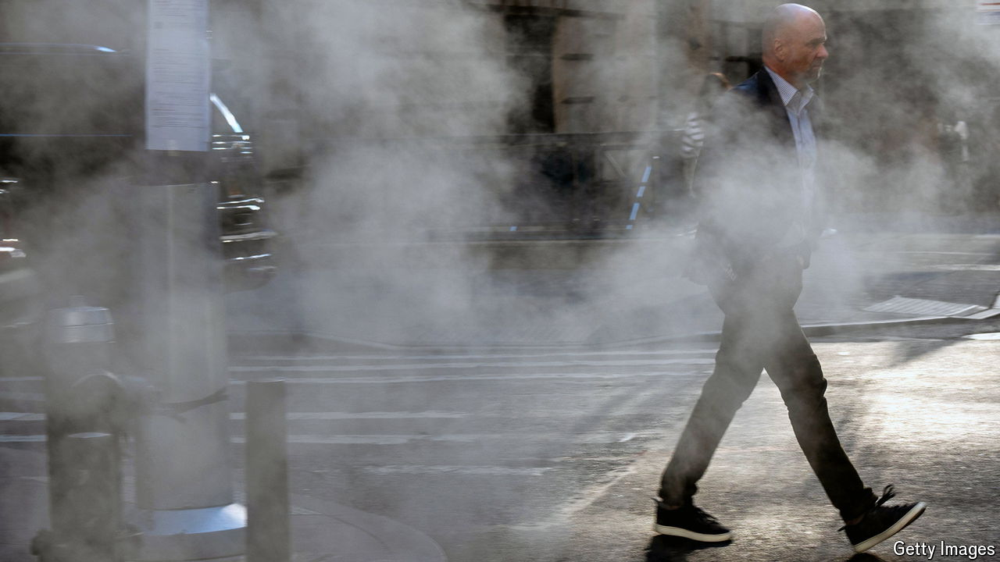

###### Campaign calculus: the customer is sometimes wrong

# Voters won’t thank Kamala Harris for the state of the economy 

##### Why voters are down on America’s remarkable economy 

 

> Oct 17th 2024 

Politicians rarely tell voters they are wrong. For Democrats trying to sell America’s economic success, the temptation must be strong. As our special report explains, the country’s economy is one of the . Americans are richer than at the start of President Joe Biden’s term. Yet they struggle to believe it: in weekly polling conducted by YouGov since mid-2021, almost twice as many say the economy is getting worse as say it’s getting better.

