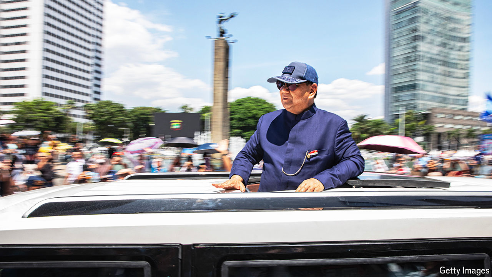

###### Getting to know Prabowo

# Indonesia’s macho new leader is no “cuddly grandpa” 

##### Prabowo Subianto has fought back from years of disgrace and exile 

 

> Oct 22nd 2024 

Wearing a blue tunic, Prabowo Subianto waved from a gleaming white jeep on his way to the presidential palace after becoming Indonesia’s eighth president on October 20th. Sun-baked crowds waved back. For the retired general, it was the triumphant final leg of a quarter-century journey back to the centre of power from disgrace and exile. It is also the first time in a decade that there has been a major shift in Indonesian politics. 

