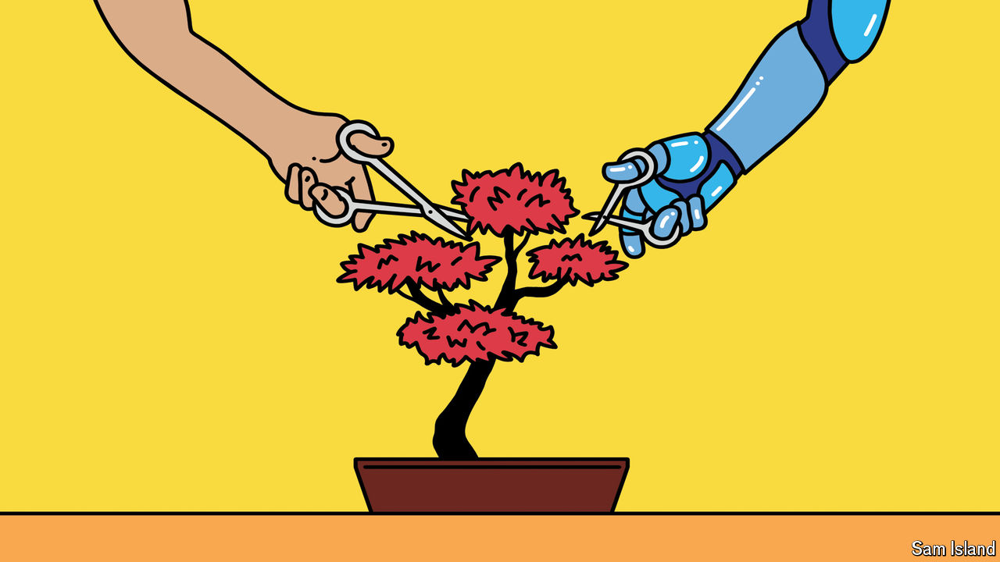

###### Banyan

# Japan is remarkably open to AI, but slow to make use of it 

##### The land of Doraemon embraces the new technology in theory but not in practice 

 

> Oct 24th 2024 

WHICH cultural icons come to mind when an American thinks of artificial intelligence (AI)? The cyborgs of the “Terminator” film series, or Hal of Stanley Kubrick’s “2001: A Space Odyssey”—rogue computer systems that rise up to destroy their human creators. What does a Japanese person recall? Doraemon, the friendly robot helper of an enormously popular eponymous anime series. So goes an anecdote making the rounds in Japanese tech circles. It suggests that Japan is a land of opportunity when it comes to AI. 

