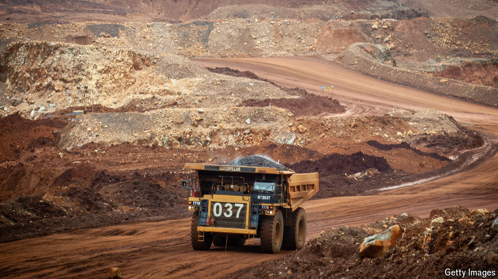

###### Prabowo’s plans for nickel

# Making nickel is a nightmare. Unless you are Indonesian 

##### Gluts and shortages notwithstanding, Indonesia wants to double down on resource nationalism 

 

> Oct 24th 2024 

A skim of this year’s nickel-market commentary reveals a “Darwinian” “existential moment” of “carnage”. Benchmark prices tumbled by as much as 72% from all-time highs in 2022. From Australia to Brazil, nickel mines and furnaces are being shut down or sold off. Most agree on who is responsible for the destruction: Indonesia. The country’s vast nickel reserves, lax environmental rules and cheap coal-fuelled power let its producers undercut competitors. Since Indonesia introduced a ban on raw nickel-ore exports in 2020, as part of a policy of “downstreaming”, or moving towards higher value-added activity, Chinese investment has poured in. It now makes nearly half the world’s refined nickel and two-thirds of its mined nickel. Both shares have doubled since 2020. 

