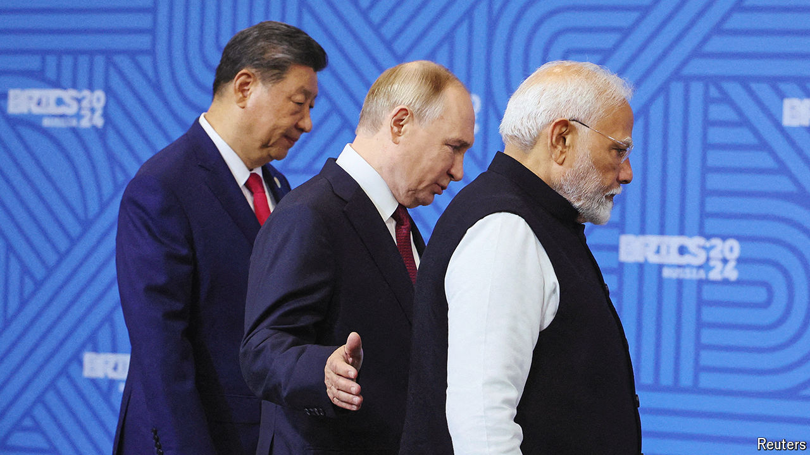

###### Himalayan handshake

# Narendra Modi and Xi Jinping meet and resolve a border row 

##### The meeting in Russia signals a new era of closer ties 

 

> Oct 24th 2024 

A fatal border clash between India and China in 2020 did not just open a four-year fissure in bilateral ties: it triggered a tectonic shift in Asia’s geopolitics. In its aftermath, the two countries each sent tens of thousands of troops to their disputed Himalayan frontier, backed by artillery, missiles and fighter jets. China expanded military aid to Pakistan, India’s rival to the west. India, meanwhile, restricted Chinese investment and deepened defence ties with America and its allies. They, in turn, came to see India as a key partner in containing China.

