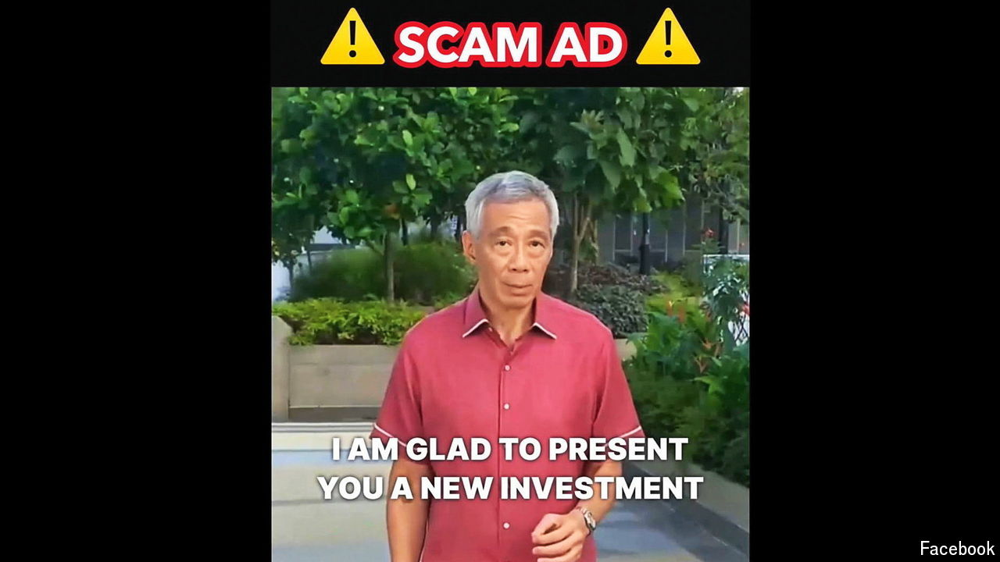

###### South-East Asia’s criminal scams

# Suck up to your fake CEO 

##### The deepfake scam explosion has only just begun 

 

> Oct 24th 2024 

It seemed like just another video call. Earlier this year, a finance worker based in Hong Kong for Arup, a British engineering firm, logged in for what he thought was a routine team meeting. On the screen, he saw several colleagues, including the firm’s chief financial officer, who instructed him to transfer $26m to five different bank accounts. He complied. But the man on the call was not Arup’s CFO: it was a deepfake. 

