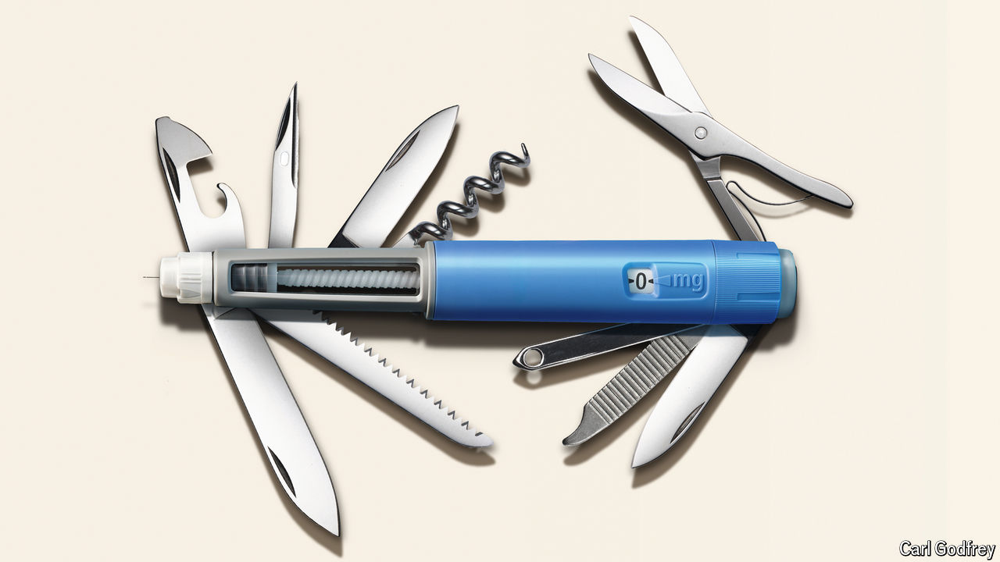

###### The Swiss Army knife of jabs

# GLP-1s like Ozempic are among the most important drug breakthroughs ever 

##### Their far-reaching potential could transform how chronic diseases are managed 

 

> Oct 24th 2024 

IN THE HISTORY of medicine, a few drugs tower above all others. Humira for rheumatoid arthritis; Prozac for depression; statins to prevent heart disease and strokes. All have helped patients far beyond doctors’ initial expectations and continue to benefit millions of people every day. A new class of drugs is set to join their ranks and has the potential to eclipse them all—GLP-1 receptor agonists.

