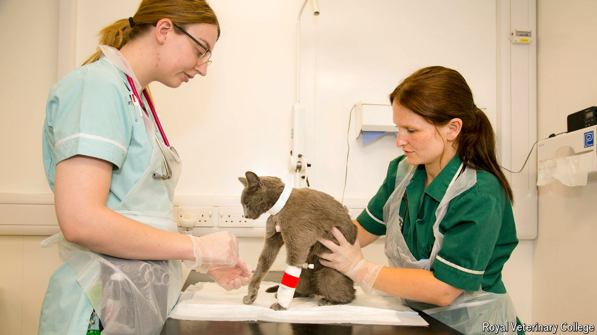

###### Fur’s aid

# Britain is a world leader in pet health care 

##### It’s never been a better time to be a diabetic cat 

 

> Oct 24th 2024 

AN ONCOLOGY patient lies face down, surrounded by an expert team, as they edge him into a state-of-the-art CT scanner. In the intensive-care unit a ventilated patient lies under an inflatable warming blanket, receiving one-to-one care from a specialist nurse; watching on is an anaemia sufferer wearing an unseasonal Christmas jumper. There is an emergency room but this afternoon it is empty, says Vicky Lipscomb, a soft-tissue surgeon and the hospital’s clinical director. Welcome to the Queen Mother Hospital for Animals (QMHA) in Hertfordshire.

