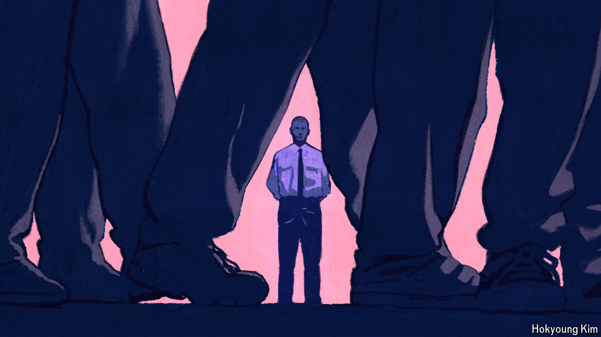

###### It’s worse than you think

# Britain’s prison service is caught in a doom loop 

##### Overcrowding leads to violence. Violence worsens a staffing crisis. A staffing crisis impedes rehabilitation 

 

> Oct 22nd 2024 

When andy laidlaw began working as a prison officer in 1998 it was “an enjoyable job”. There were “low lows” as well as “high highs”, but it was mostly safe and you “could feel like you were making a difference”. Mr Laidlaw, a straight-talking Scouser, climbed the ranks, eventually becoming a deputy governor. He describes the work—which demanded the skills to handle the most troubled people and the dexterity to “get assaulted safely”—with pride. The best officers were a “mixture of Kofi Annan and an MMA champion”. 

