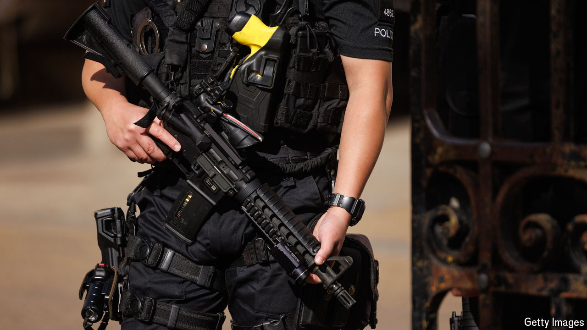

###### The Chris Kaba case

# How to hold armed police to account in Britain 

##### A murder charge angers officers and sparks reforms 

 

> Oct 24th 2024 

THE video clips from body-worn cameras will have been seen by millions of Britons. Armed police jump out of their cars and swarm around a black Audi, yelling “show me your hands!” The driver briefly ducks, before lurching his car forward, ramming a police car in front. He then reverses, hitting another police car. After 15 seconds, a single shot is fired. 

