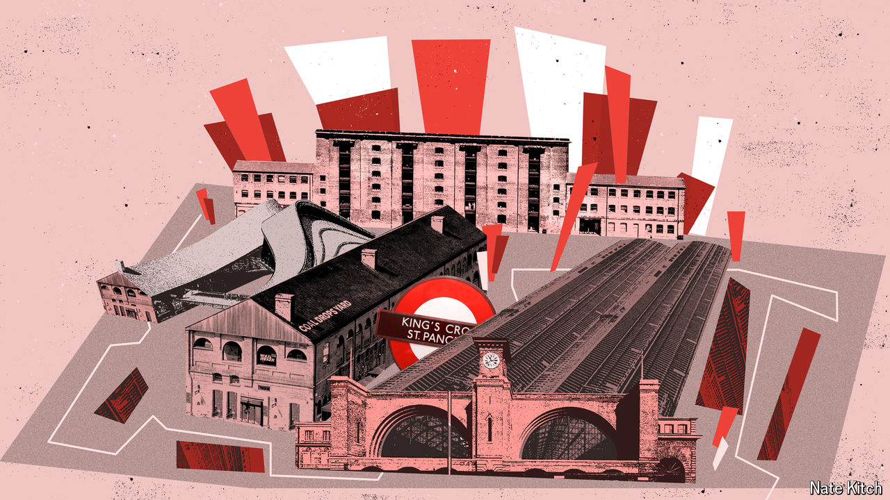

###### Bagehot

# King’s Cross, a miracle in London 

##### If Britain has a future, it’s there 

 

> Oct 23rd 2024 

To gauge whether Britain is going to make it, go to the central London district of King’s Cross. Exit the station to the west and then head north to Regent’s Canal. Stride past the solitary but well-used children’s swing inside the technicolour birdcage. To your right is Google’s sidescraper—a flat, 300-metre-long slug of wood, concrete and glass, which is due to open next year. To your left is the new headquarters of , a pharma giant, which moved here in 2022. Cut through a snicket and past Universal Music Group, which in 2018 ditched plush Kensington for an area that has gone from industrial wasteland to the best hope for the  in barely a decade.

