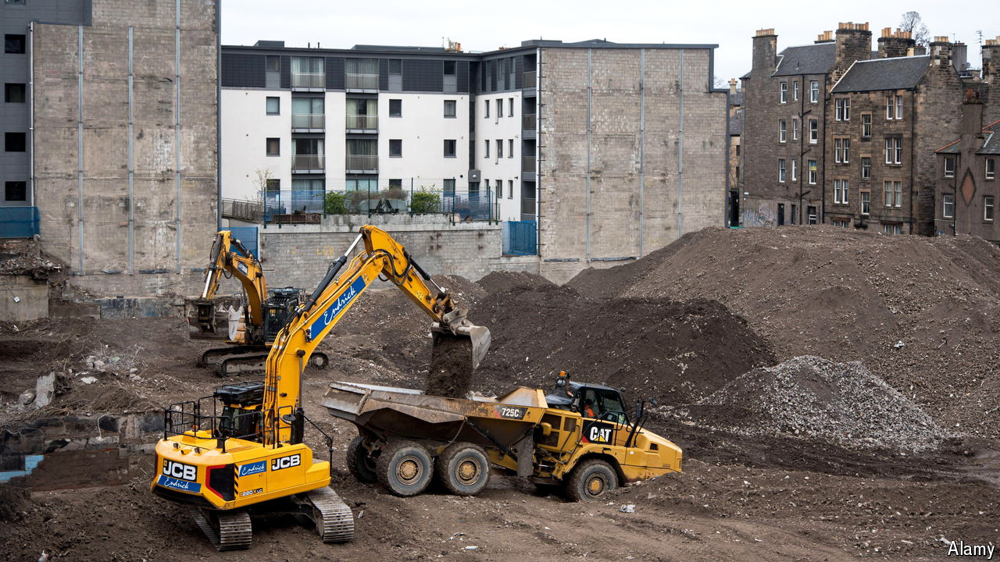

###### A construction slowdown

# Scotland’s failure to build homes is mainly due to its government 

##### Meddling in the market has not worked 

 

> Oct 24th 2024 

Students in edinburgh are in for a treat. If its plans are approved, Ediston, a developer, will soon build hundreds of student rooms on the northern edge of the New Town, the most elegant part of a fine city. Or perhaps you would prefer to study in Glasgow? If so, you might be able to live in a new tower, the Ard, which will be Scotland’s tallest residential building. The surge of high-quality accommodation is a boon for students. But it is also a sign that something has gone badly wrong in Scotland’s housing market. Developers are putting up student housing because it makes little sense to build anything else. For that, thank the Scottish government. 

