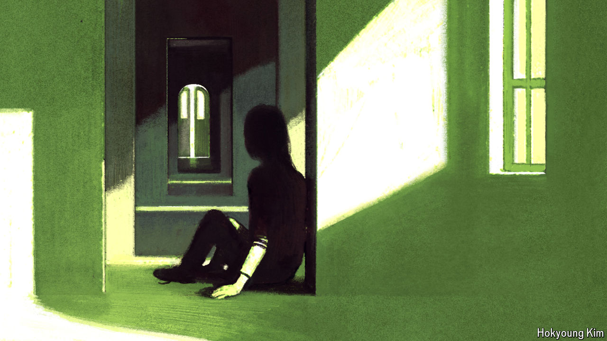

###### Match postponed

# The shortfall in British adoptions 

##### The cost-of-living crisis has hurt children and prospective parents 

 

> Oct 24th 2024 

If “Oliver Twist” were written today, it would be different in many ways. One of them might be the ending. In Charles Dickens’s novel, Oliver is adopted by Mr Brownlow, a benefactor, without any trouble. Today Mr Brownlow would go through a fine-grained background check. His mansion would be inspected for safety and he’d be strongly advised to volunteer with children. If he liked a pipe after dinner, he could end up being rejected for smoking.

