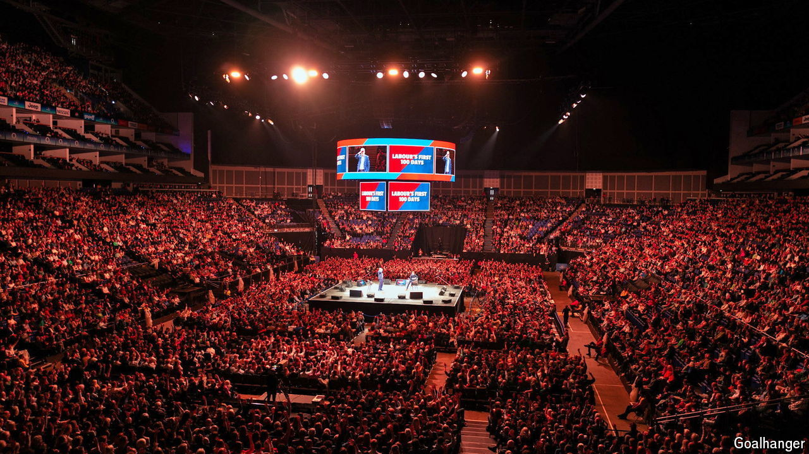

###### The most sensible show on earth

# Why “The Rest Is Politics”, a British podcast, is a hit 

##### Centrism and an old-fashioned approach to broadcasting are at its core 

 

> Oct 21st 2024 

THE volume is thundering, the lighting dazzling. Some in the crowd who fill the O2 arena in east London on October 15th are downing burgers and beer; others wear T-shirts bearing their heroes’ faces. And on a small stage in the centre of the venue, Rory Stewart, a 51-year-old former Tory MP in a Nehru jacket, is talking about the tax policies of the new Labour government. “They’ve ruled out income tax, which is the blue; VAT, which is the silver,” he sighs. Around the arena 15,000 pairs of eyes study a colourful graph that fills the screens suspended over his head. “All the other stuff is rounding errors!” There is applause, and a shout of: “More!”

