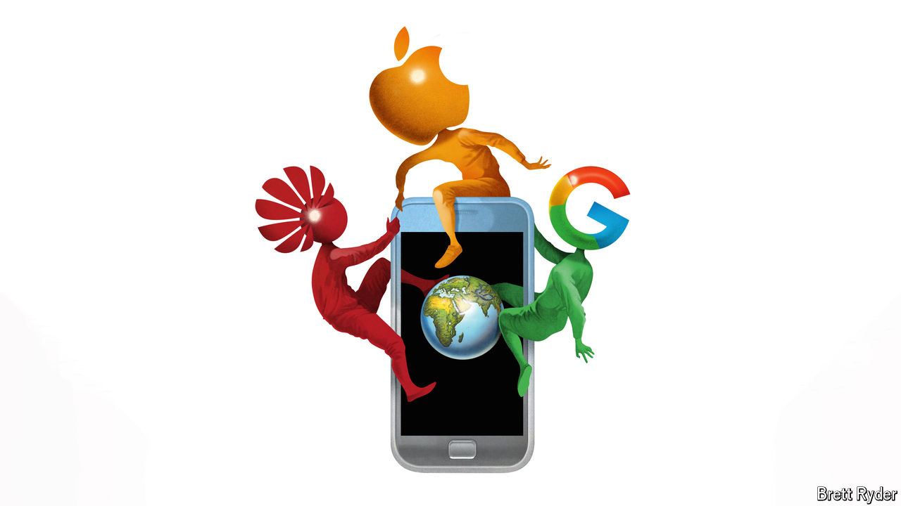

###### Schumpeter

# Can Google or Huawei stymie Apple’s march towards $4trn? 

##### The contest for global smartphone dominance gets interesting 

 

> Oct 24th 2024 

TO CALL APPLE a corporate behemoth is to be uncharitable. It is much bigger than that. On many financial measures it makes more sense to compare the iPhone-maker not with other companies but with stockmarket indices—and not some obscure ones, either. Exclude financial firms and India’s Nifty 50 sit on less cash. When Apple reports its annual results on October 31st analysts reckon its net profit will be just below what Germany’s DAX blue chips raked in last year. On October 21st its market capitalisation nudged $3.6trn, more than Hong Kong’s Hang Seng. 

