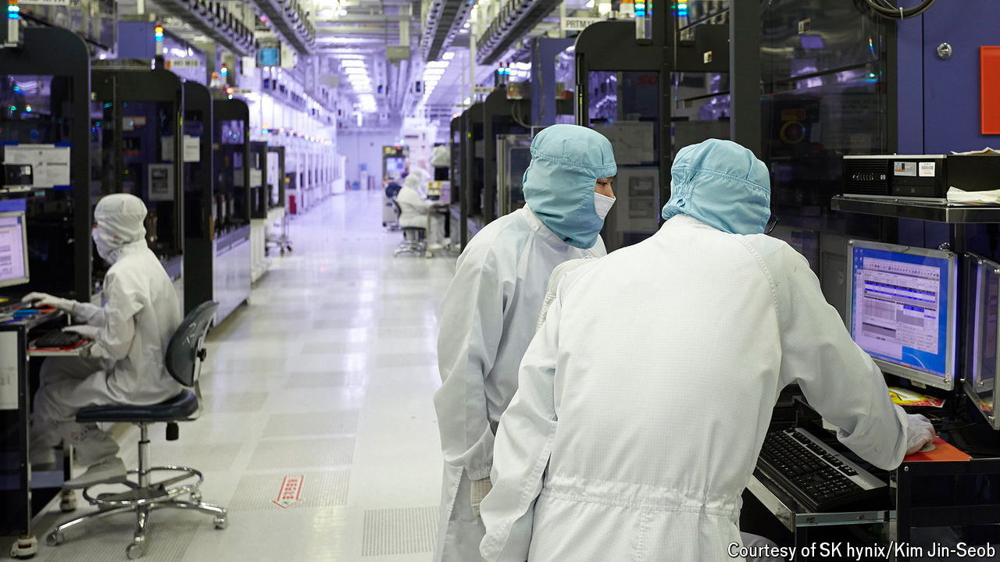

###### Down memory lane

# Memory chips could be the next bottleneck for AI 

##### SK Hynix is dominating the market 

 

> Oct 24th 2024 

Investors are accustomed to volatility in the semiconductor industry. But recent ups and downs have been especially discombobulating. On October 15th ASML, a supplier of chipmaking gear, reported that orders during its most recent quarter were only half what analysts had expected, causing its shares to plunge. Two days later TSMC, the world’s biggest chip manufacturer, reported record quarterly profits and raised its sales forecast for the year. 

