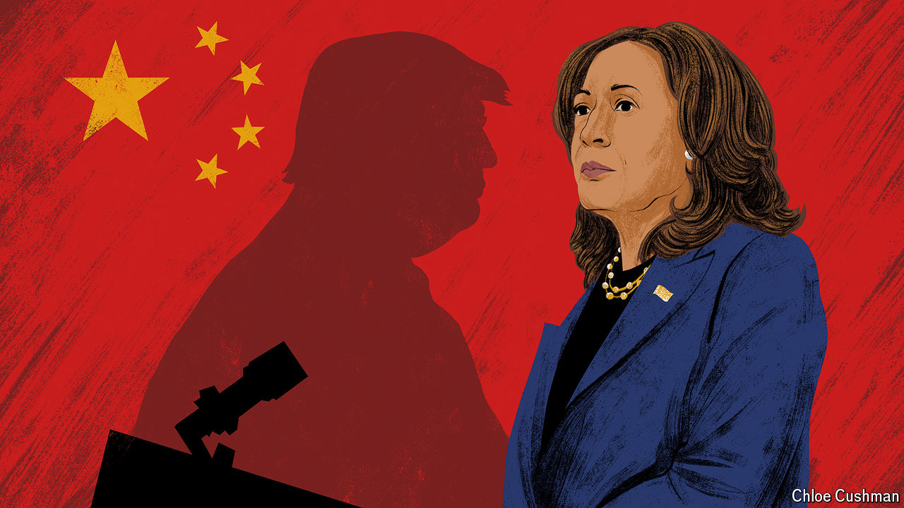

###### Decoding America’s election

# Ambiguity or madness? Where Harris and Trump stand on China 

##### The vice-president makes no promise to defend Taiwan; her rival boasts of being crazy 

 

> Oct 23rd 2024 

THROUGHOUT HER campaign, Kamala Harris has hewed to the  of President Joe Biden. But there is a little daylight between the two in at least one important area: . To judge by her limited remarks on the topic, Ms Harris seems less hawkish than her boss. She is reluctant to treat China as an actual or potential enemy and, if elected, hopes to maintain a dialogue with its leader, Xi Jinping. Unlike her rival, Donald Trump, she is not interested in a . This impression was reinforced by a senior adviser who told : “Conflict is not imminent. Our job is to ensure that it is not imminent.” 

