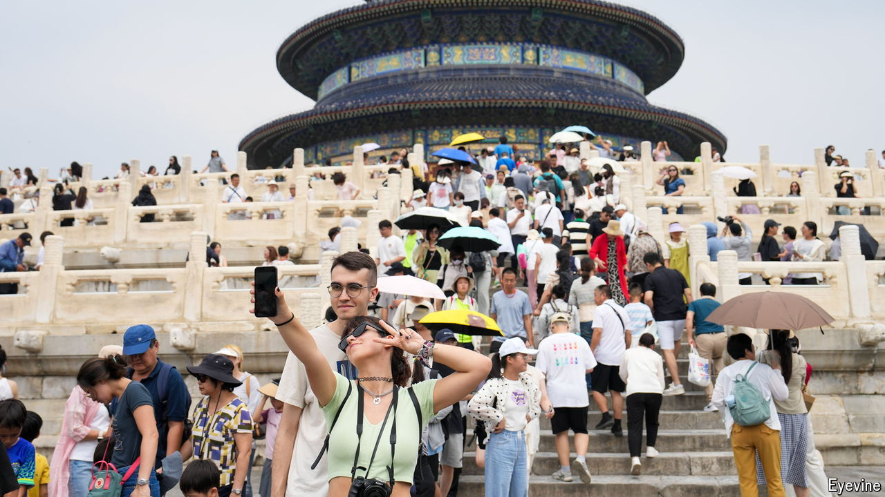

###### A long way to go

# How China is trying to win back foreign tourists 

##### Come, spend, don’t worry about a visa 

 

> Oct 24th 2024 

Interesting, safe and easy to get around, China has what it takes to be the top tourist destination in Asia. Indeed, it was. In the first half of 2019, before covid-19 hit, China’s travel agencies handled 8.6m tourist visits, more than any other country in the region, according to the government (see chart 1). China’s border authorities recorded 47.7m entries and exits by foreigners, including non-tourists, over that period. But after plummeting during the pandemic, those numbers have yet to fully recover, coming in at 3.1m and 29.2m, respectively, in the first half of this year.

