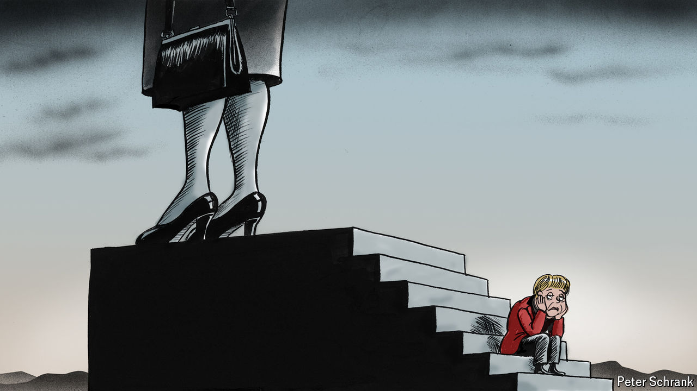

###### Charlemagne

# Angela who? Merkel’s legacy looks increasingly terrible 

##### 16 years of no reforms are taking a toll on Germany and Europe 

 

> Oct 24th 2024 

Two women have thoroughly dominated the politics of their respective northern European countries in living memory. Beyond their gender, Angela Merkel and Margaret Thatcher are often lumped together as centre-right stalwarts with a knack for political survival. They governed very differently—one menacingly wielding her handbag, the other patiently cajoling coalition partners—but for so long that by the time they stepped down even teenagers could not recall anyone else having been in charge. But their legacies look more different still. Though Thatcher was forced out by her own party in 1990 as her poll numbers slid, she has since topped a poll of Britain’s best post-war leaders; Sir Keir Starmer, the current prime minister, last month faced brickbats for merely moving the portrait of his predecessor-but-eight to a different part of Downing Street. Mrs Merkel opted to retire after four terms, still so popular that both her party’s candidate and the opposition fellow (now in office) tried to claim her mantle. Yet every month that goes by brings a reminder of how her reign propelled Germany into the mire.

