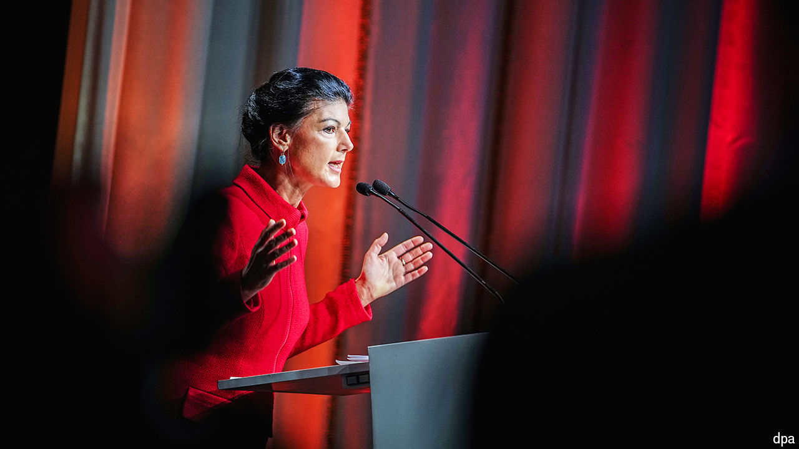

###### The disrupter-in-chief

# Germany’s populist superstar demands peace with Russia 

##### In an interview Sahra Wagenknecht trashes the consensus on Ukraine—and much more 

 

> Oct 23rd 2024 

FEW GERMAN politicians divide opinion like Sahra Wagenknecht. A Putin-loving demagogue to her detractors, simply “Sahra” to her legions of adoring fans, Ms Wagenknecht has injected a high-octane blast of populism into a country that prefers its politics staid and consensual. Invariably decked out in her trademark high-necked jackets, Ms Wagenknecht rules the airwaves with her brainy but pointed polemics on Ukraine, immigration and other prickly subjects. Her political formula is unorthodox, yet the success of her , a party she launched only in January, proves a talent for political entrepreneurship. And she has developed an uncanny knack for forcing other politicians to dance to her tune.

