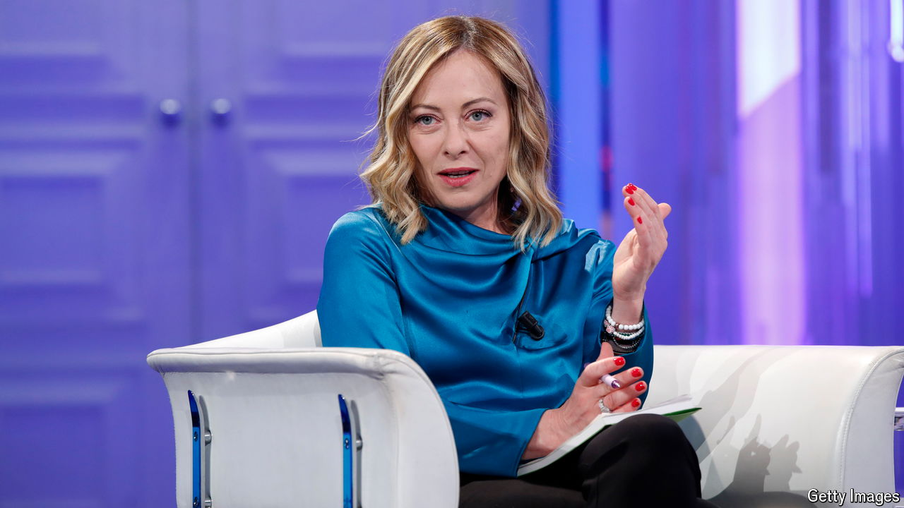

###### The tightrope walker

# Giorgia Meloni would make Machiavelli proud 

##### Italy’s prime minister is far more popular than Emmanuel Macron and Olaf Scholz 

 

> Oct 21st 2024 

THE POLITICS of Italy have long been trapped in a cycle of rancid interaction between judges and prosecutors on the one hand and conservative politicians on the other. It dates from at least 1994, when the then prime minister, , was served with a subpoena while hosting a conference in Naples on organised crime. Berlusconi and  claimed he was a victim of politically motivated jurists—and repeated that claim  over the years that followed.

