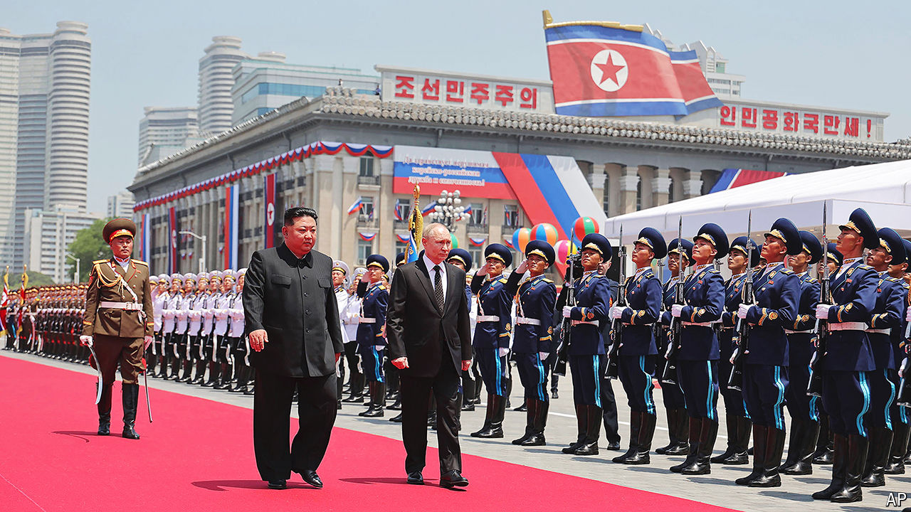

###### Blood brothers

# North Korea is sending thousands of soldiers to help Vladimir Putin 

##### It shows how far Russia has fallen as a strategic power 

 

> Oct 22nd 2024 

UKRAINE’S PRESIDENT, Volodymyr Zelensky, declared last week that  is sending troops to Russia, in effect joining the invasion as a co-combatant. The appearance of one of the world’s most erratic and heavily-armed nations in the fight might test the best-resourced and well-rested defences. After 32 months of grinding war against a much larger enemy, . 

