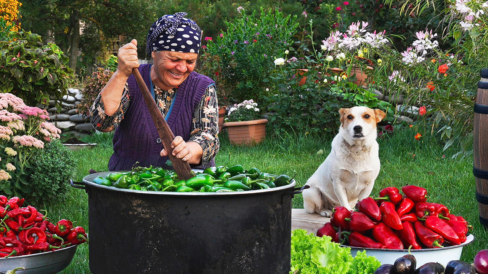

###### Country cuisine

# The world’s most improbable smash-hit cooking show 

##### It’s notching up billions of YouTube views 

 

> Oct 24th 2024 

“THIS IS A balm for the soul, this is real relaxation,” reads a comment on YouTube under Country Life Vlog. But can cooking pilaf with beef and pumpkin or baking bread on a barrel really have a transforming effect? With nearly 7m subscribers and 2bn views, to say it is boring is to miss the point. Those tuning in from London, Sydney, Yekaterinburg and Kyiv do so for a glimpse of a tiny arcadia on the southern flanks of the Caucasus Mountains. Five years in, there are no special effects, plot twists or suspense. What the almost 500 episodes (around 25 minutes each) unapologetically provide is a dollop of tranquillity and harmony with nature. The echo is of a bygone era where summer fruit was canned for the winter months and simple agricultural chores were part of food preparation.

