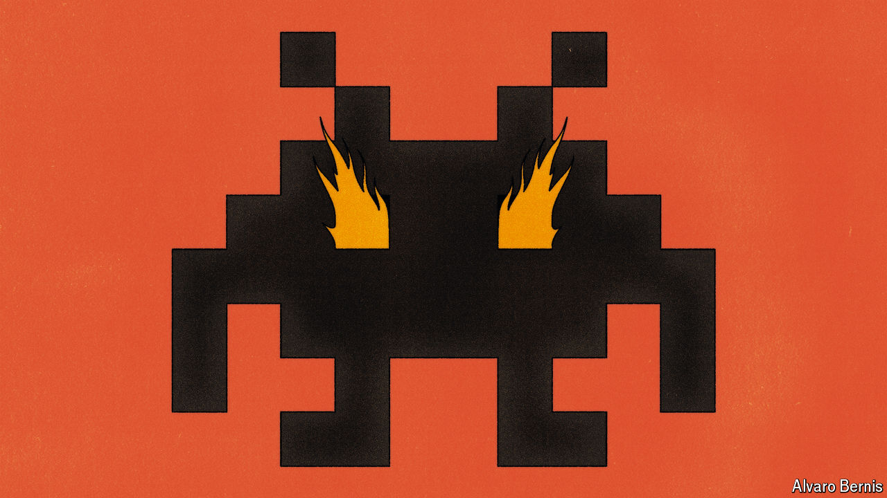

###### Free exchange

# How bad are video games for your grades? 

##### Chinese students provide an answer 

 

> Oct 24th 2024 

Arriving on the magical continent of Teyvat, you and your twin are attacked and separated by an unwelcoming god. When you regain consciousness, you set off in search of your lost sibling, exploring seven beguiling worlds (one of which resembles a Chinese national park). Along the way you team up with other heroes, blessed with elemental powers. One can cross lakes by freezing the water beneath his feet. Another can float on air currents of his own creation. Together, your travelling party must fight monsters, solve puzzles and plunder treasure chests.

