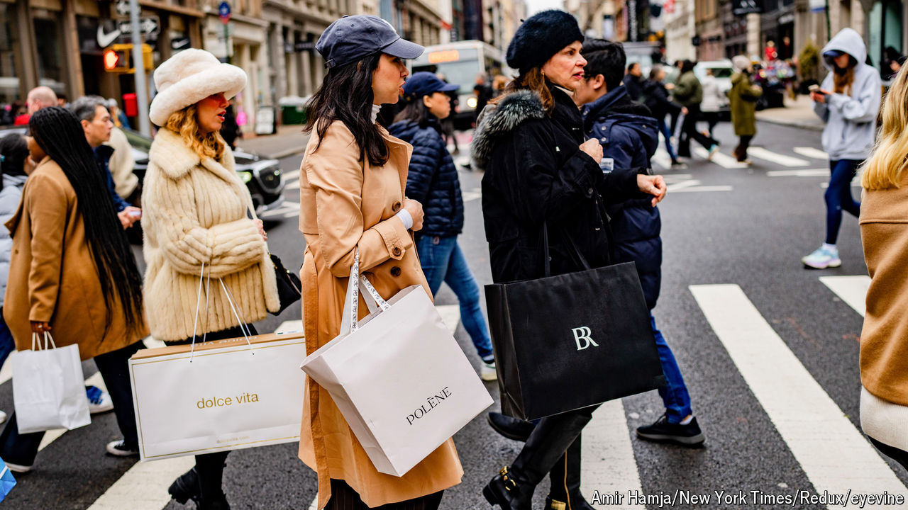

###### Wide Atlantic

# The West faces new inflation fears 

##### Having moved in lockstep, America and Europe now have very different concerns 

 

> Oct 20th 2024 

Central bankers have avoided celebrations. They know full well that consumers and firms, stung by the highest inflation since the 1970s, would not appreciate them. In private, though, many are elated. The sharpest rise in borrowing costs in decades, dubbed “the great tightening” by the IMF, appears to have worked better than anyone expected. Global inflation has retreated to more comfortable levels. Better still, this has been achieved . 

