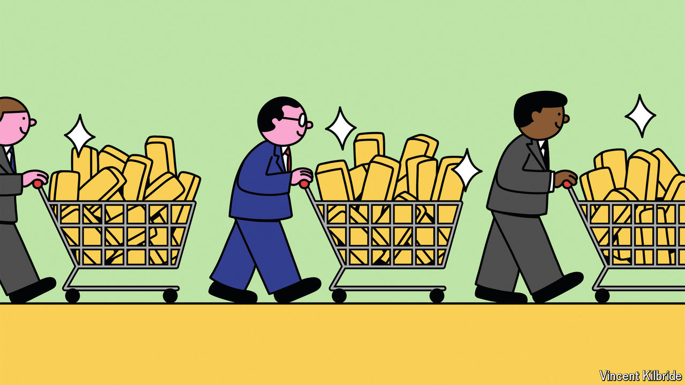

###### Going for it

# What the surging price of gold says about a dangerous world 

##### Financial fears and geopolitical tremors combine to great effect 

 

> Oct 22nd 2024 

Less than a mile from Singapore’s luxurious Changi Airport sits a rather less glamorous business park. Residents of the industrial estate include freight and logistics firms, as well as the back offices of several banks. One building is a little different, however. Behind a glossy onyx facade, layers of security and imposing steel doors, sits more than $1bn in gold, silver and other treasures. “The Reserve” hosts dozens of private vaults, thousands of safe-deposit boxes and a cavernous storage room where precious metals sit on shelves rising three storeys above the ground. 

