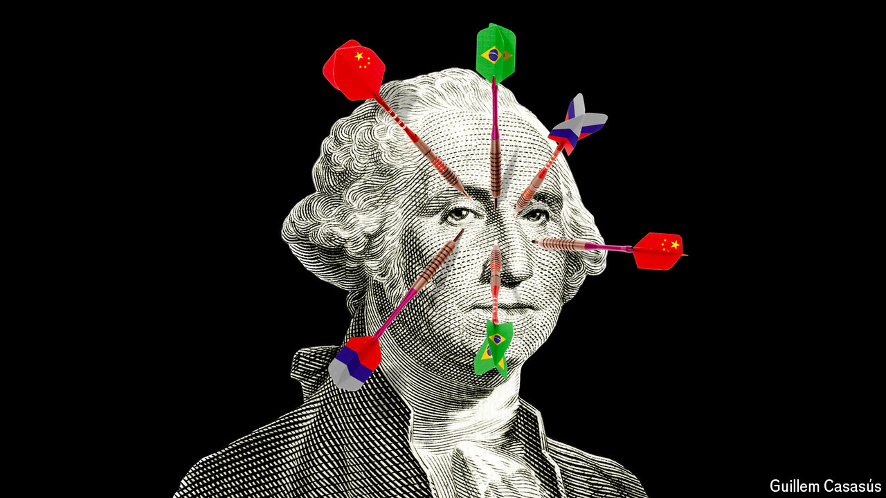

###### Launching a currency war in Moscow

# Putin’s plan to dethrone the dollar 

##### He hopes this week’s BRICS summit will spark a sanctions-busting big bang 

 

> Oct 20th 2024 

VLADIMIR PUTIN, Russia’s president, was cock-a-hoop on October 22nd when he welcomed world leaders including Narendra Modi of India and Xi Jinping of China at the BRICS summit in Kazan on the Volga river. Last year, when the bloc met in South Africa and , Mr Putin had to stay home to avoid being arrested on  issued by the International Criminal Court in The Hague. This time he played host to a rapidly growing club that is challenging the dominance of the Western-led order.

