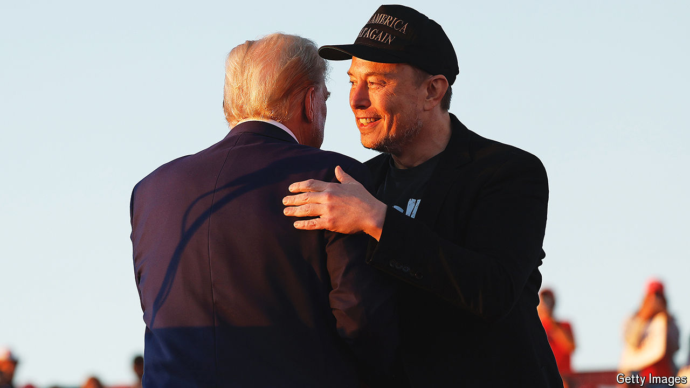

###### Leaders

# Elon’s $1m voter 

##### Mr Musk’s scheme to boost Donald Trump is legally questionable and bad for democracy 

 

> Oct 23rd 2024 

WITH LESS than two weeks to go, America’s election remains a coin-toss. If anything, though, the coin now slightly favours Donald Trump. Our election-forecast model puts him ahead, for the first time since August. When the race is this tight, the list of things that could prove decisive is long. Among them is Elon Musk’s disingenuous scheme to induce Americans to vote for Mr Trump with a .

