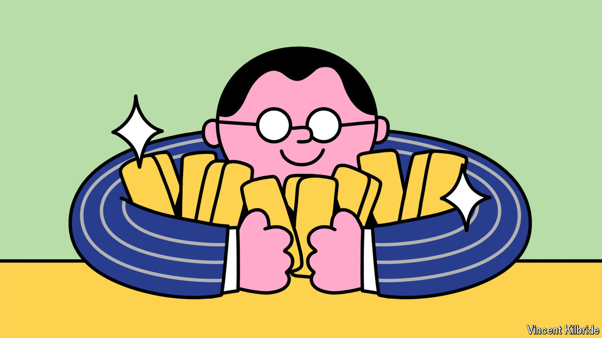

###### Status anxiety

# The blistering rally in gold augurs ill for the power of the dollar 

##### Central banks are shifting away from the greenback 

 

> Oct 24th 2024 

Not LONG ago gold seemed to have lost its lustre. In the decades after President Richard Nixon abandoned the gold standard in 1971, the yellow metal fell out of favour with central banks, which hoarded their reserves in dollars instead. In the 1980s and 1990s investors and households grew weary of its miserly returns. Goldbugs were dismissed as eccentric doom-mongers. Gold was alluring when forged into a shiny bauble and useful in specialist manufacturing, but it was hardly a serious financial asset.

