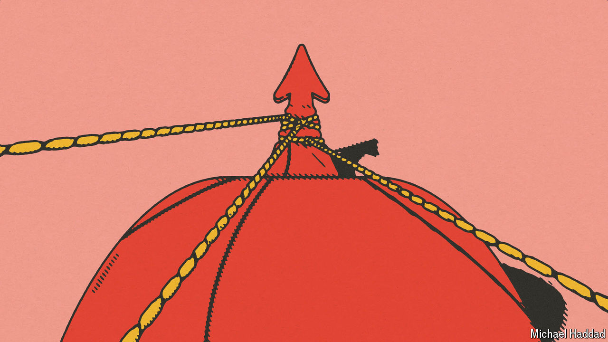

###### Making business roar

# Time to shake up Asia’s sleepy monopolies 

##### The cosy links between politics and business impose large costs on a dynamic region 

 

> Oct 24th 2024 

IN HIS INAUGURAL address as Indonesia’s new president on October 20th, , a 73-year-old former general, vaunted his country’s consensual model of politics as something to be proud of. His vice-president, Gibran Rakabuming Raka, is the son of , his predecessor, and he has assembled a huge cabinet that incorporates a wide range of business families.

