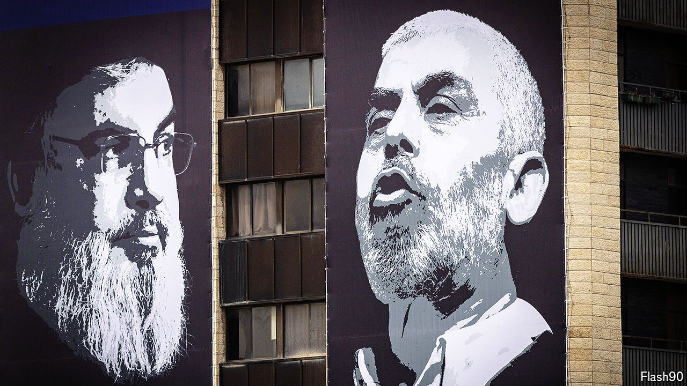

###### Killing an idea

# Do Israel’s assassinations work? 

##### Why the conventional wisdom about decapitating Hamas and Hizbullah might be wrong 

 

> Oct 24th 2024 

It has become almost an article of faith: assassinations don’t matter. For more than a year Israel has been killing leaders of Hamas, a Palestinian Islamist group, and Hizbullah, a Lebanese Shia militia. Each time it does, a chorus of officials and analysts insist that Hamas and Hizbullah will simply regroup and regain their previous strength. Maybe so: Israel’s history offers ample reason for such scepticism. But there is also good reason to believe that this time may be different.

