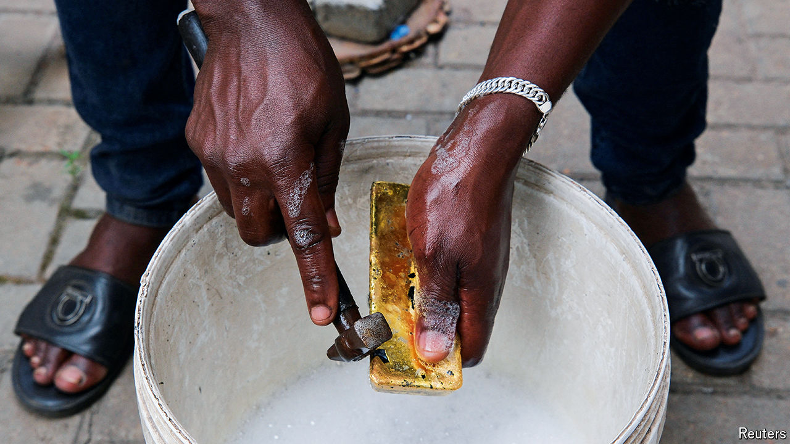

###### Not so mellow

# Gold is booming. So is the dirty business of digging it up 

##### It is mined in Africa, traded in Dubai and lucrative for warlords and jihadists 

 

> Oct 24th 2024 

“It keeps getting worse and worse,” sighs Camry Tagoe, an activist in Accra, the capital. “If you look at Google maps, Ghana has turned from green to brown.” Over the past month Mr Tagoe has helped organise protests across the city that call for an end to “galamsey”, or wildcat gold mining. Long a way of getting by in the west African country, it has exploded in recent years, damaging forests and polluting water. The protesters blame politicians, many of whom own mining firms, for letting the practice get out of control. Galamsey is a crucial issue ahead of elections on December 7th. 

