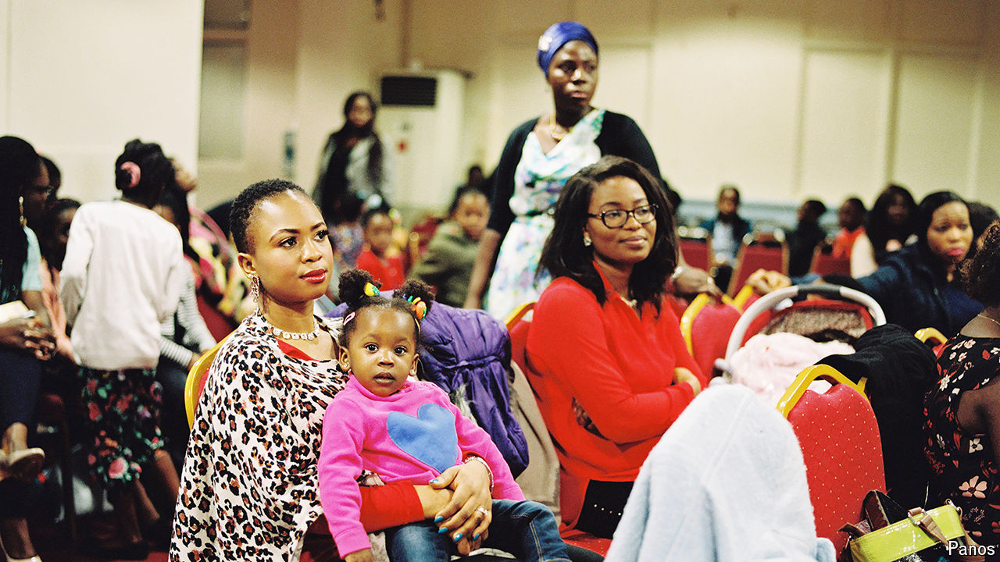

###### Religion re-rooted

# How African churches are keeping the faith alive abroad 

##### A revamped version of the prosperity gospel appeals to young immigrants 

 

> Oct 24th 2024 

The service is off to a chaotic start, in true Nigerian fashion. The band is missing a member. The head pastor is nowhere to be found. With some delay the lead vocalist, wearing a pink sequinned turban, begins to sing: “” (“You are worthy, Father you are worthy” in Yoruba, which is spoken in south-west Nigeria). She could be in Lagos, Nigeria’s commercial capital. But the church is in Croydon, on London’s southern fringe.

