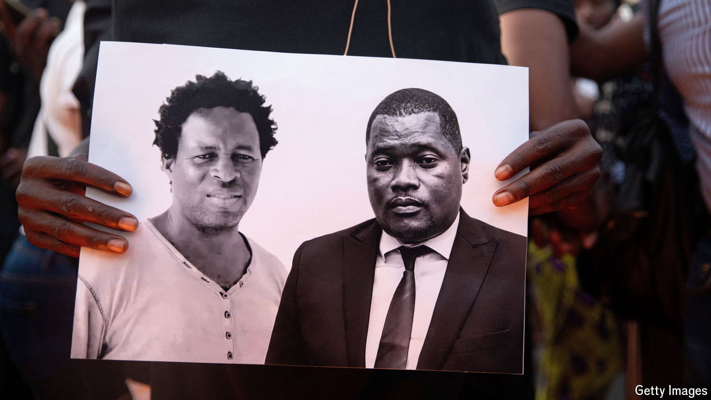

###### The wages of truth

# Mozambique’s ruling party wins a dodgy election 

##### Two opposition figures were murdered days before the result was announced 

 

> Oct 24th 2024 

He feared he was a marked man. In April Elvino Dias wrote on Facebook that death squads were plotting to kill him. But as a lawyer for an opposition leader, in an election year, he felt it was his duty to speak out. “In a country as upside down as ours, truth and justice have their price,” he wrote, “and the biggest price is the death of the one who says it.”

