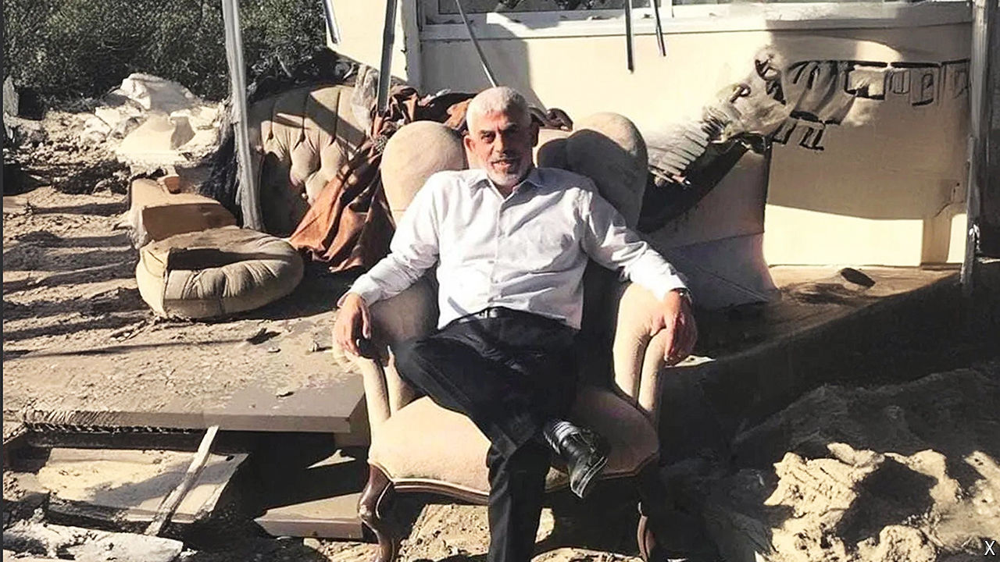

###### Yahya Sinwar’s death

# Yahya Sinwar made Hamas his own fief 

##### Will his successor embrace more violence or compromise? 

 

> Oct 24th 2024 

After the Israel-Hamas war in Gaza in 2021 Yahya Sinwar appeared sitting in an armchair in the open air, surrounded by rubble and smiling. It became a defining image of defiance for many Hamas supporters. This time the story ended differently. Mr Sinwar died in the ruins of Gaza, like tens of thousands of victims of the war he unleashed a year ago. In a firefight with an Israeli patrol in southern Gaza, the leader of Hamas, the Palestinian Islamist group, was killed on October 16th. His death leaves Hamas shattered and divided. 

