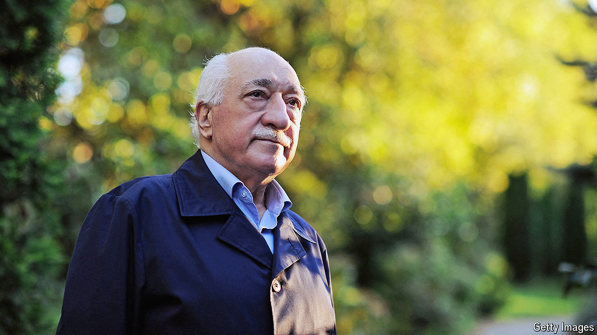

###### The Grand Infiltrator

# Fethullah Gulen tried to transform Turkey in the subtlest ways 

##### The scholar, teacher and activist died on Ocrober 20th, aged 83 

 

> Oct 24th 2024 

At the CENTRE of a luxury retreat centre in the wooded Poconos Mountains in Pennsylvania, a stocky elderly man sometimes walked slowly about. He had been there since 1999, but was not often seen. In his native Turkey he was under investigation, and from 2014 a wanted man. When, reluctantly, he let BBC journalists come to interview him that year, he showed them his living quarters: not the grand Ottoman-style palace at the centre of the private estate, but two rooms in an adjacent building. His bedroom barely had space for a mattress on the floor, his prayer mat, a chest of drawers and a glass-fronted cabinet. How modestly and simply he lived! The second room, however, was lined with crammed bookshelves, and on a desk was a computer. Through this Fethullah Gulen still regularly preached, in his archaic and Koran-coloured cadences, to his millions of followers in Turkey and beyond. It was through this he was to become the second-most-powerful man in Turkey, with only President Recep Tayyip Erdogan surpassing him. 

