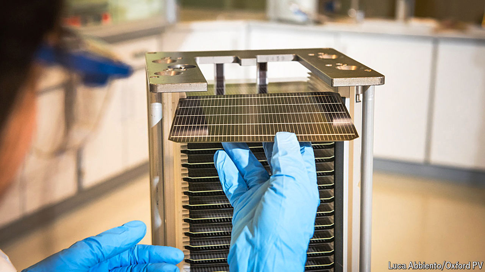

###### Sunny side up

# Perovskite crystals may represent the future of solar power 

##### Their efficiency rates far exceed those of conventional silicon panels 

 

> Oct 21st 2024 

IT is commonly claimed, and also true, that enough sunlight falls on Earth in the course of an hour to meet a year’s worth of global power needs. Some of that sunlight is currently converted into electricity by arrays of : by the end of 2023, these panels covered almost 10,000 square kilometres of Earth’s surface, producing some 1,600 terawatt-hours of electricity, about 6% of that generated worldwide. 

