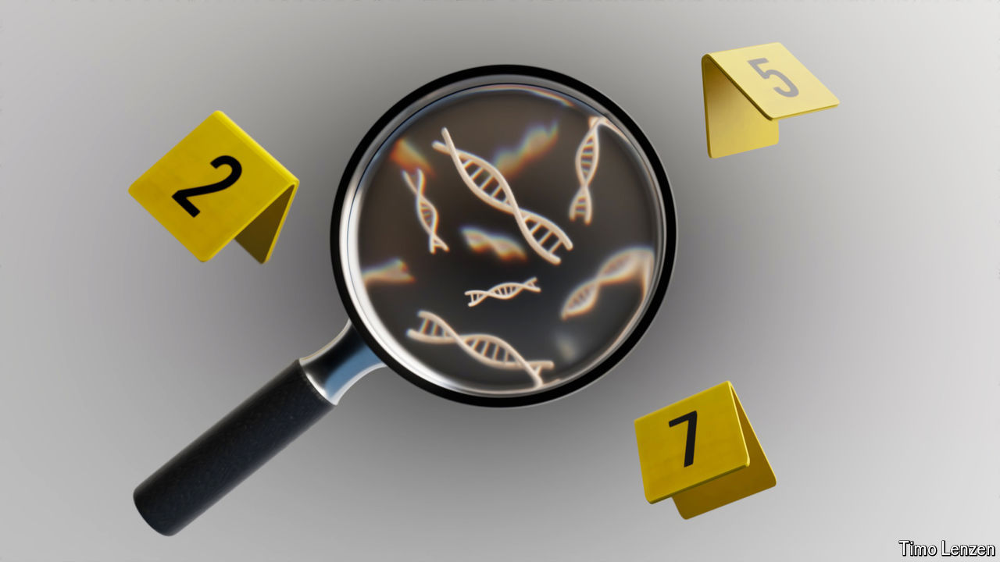

###### Old case files

# The study of ancient DNA is helping to solve modern crimes 

##### Such techniques have helped secure two convictions this year 

 

> Oct 23rd 2024 

ESKE WILLERSLEV was an unusual witness for a murder trial. An expert in  at the University of Copenhagen, his day job involved studying the lives of prehistoric peoples and extinct megafauna. And yet over the summer of 2024 he was asked to persuade a jury that he had something to offer in another field altogether: crime-scene investigation.

