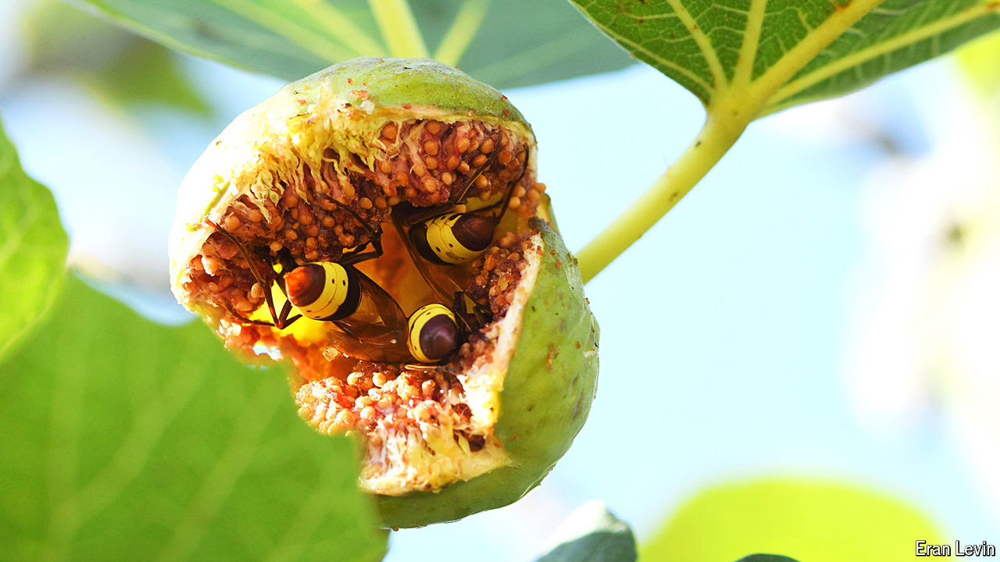

###### Buzzing without being buzzed

# Why Oriental hornets can’t get drunk 

##### They can guzzle extreme amounts for their size, without suffering ill effects 

 

> Oct 23rd 2024 

Like people, many animals enjoy having a drink every now and again. Rather than sip brandy or Chablis, though, they feed on fermented fruit, but the effects are the same. Though  is rich in calories, it muddles minds and shortens lifespans. It presents a serious risk to animals and most avoid . 

