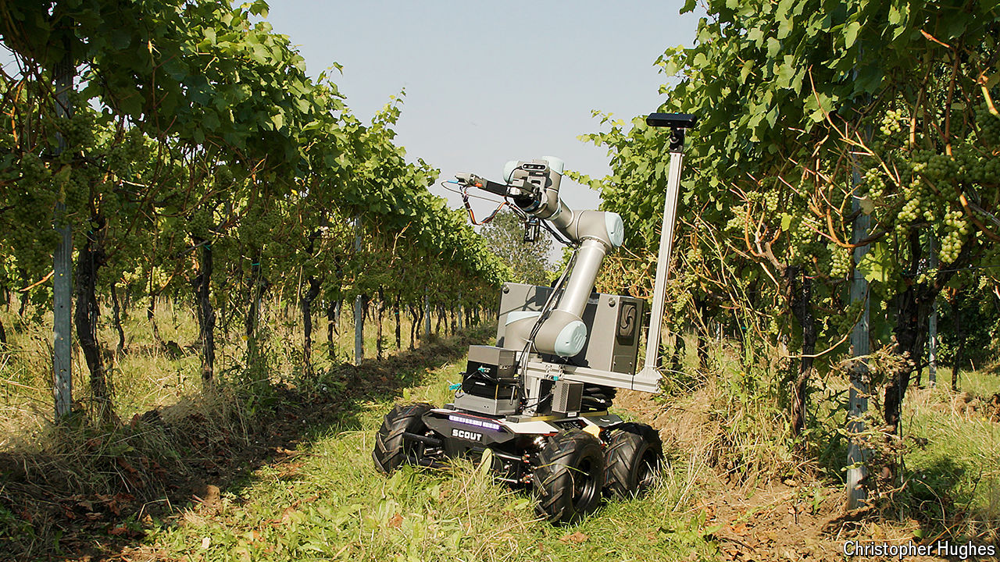

###### Robocrop

# Winemakers are building grape-picking robots 

##### Automating this delicate task is harder than it seems 

 

> Oct 23rd 2024 

Modern farms are increasingly automated—from GPS-controlled combine harvesters to machines that shake apples from trees. One task, though, seems stubbornly resistant to being ceded to robots: picking grapes.

