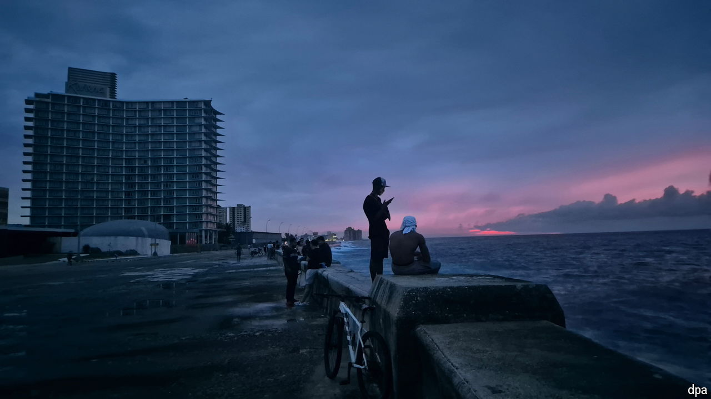

###### Dwindling prospects

# Blackouts in Cuba highlight the island’s extreme energy fragility 

##### The failure of a decrepit, oil-burning power system has plunged Cubans into darkness and misery 

 

> Oct 22nd 2024 

Miguel Díaz-Canel, Cuba’s president, usually wears boxy suits with a revolutionary-red tie. But on October 20th, after days of power blackouts across the country, he went on television sporting military fatigues reminiscent of Fidel Castro, the island’s longtime dictator. The getup conveyed two messages: first, that martial-like efforts had been made to restore power, and second, a warning to protesters. Cubans should act with “discipline” and “civility”, said Mr Díaz-Canel. Anyone disturbing public order, he warned, would be “severely” punished. 

