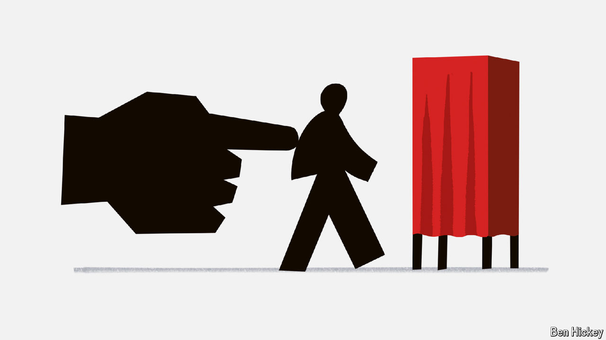

###### Much obliged

# Millions in the West want mandatory voting. Are they right? 

##### Evidence of its impact is surprisingly concentrated in a single region 

 

> Oct 24th 2024 

In the world’s most consequential election—for the next president of the United States on November 5th—just three in five voting-age citizens are expected to bother casting a ballot. Voters have become similarly passive in many democracies, from Britain to Japan. Low turnout saps government legitimacy and stokes fears of democratic decline. One group of democracies bucks the trend. When Uruguayans go to the polls on October 27th, turnout will be massive; it was above 90% in the country’s previous election, among the highest anywhere in the world. Overall, South America boasts the highest turnout of any region. That is because of the 530m people round the world who are compelled to vote, and for whom the compulsion is enforced, 343m live in South America.

