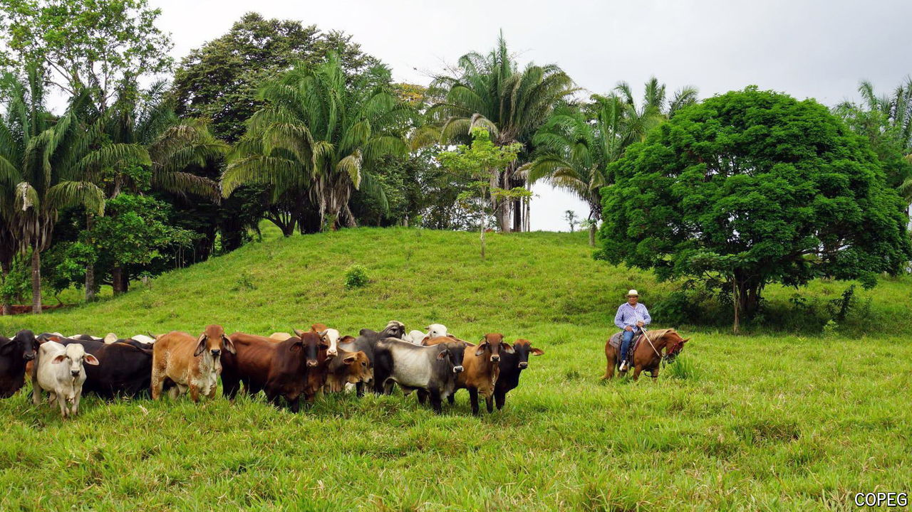

###### Climate change and parasites

# The flesh-eating worms devouring cows 

##### The Darién Gap used to protect Central America. Not any more. 

 

> Oct 24th 2024 

A screwworm infestation is gruesome. The female fly lays hundreds of eggs on the exposed flesh of warm-blooded animals. The eggs hatch into larvae which gorge themselves on the living tissue, creating a pulsating mess. Ladislao Miranda’s cattle herd in western Panama had been free of the parasite for nearly 30 years, but in May the 60-year-old rancher spotted white eggs on his animals. He now spends his days digging worms out of haunches and treating wounds with powder. “This plague is back and it’s stronger than ever,” he says. 

