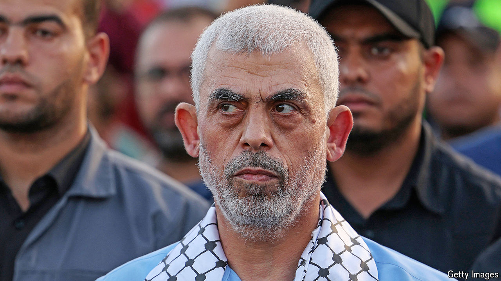

###### The world this week

# Politics 

#####  

 

> Oct 24th 2024 

Hopes of a ceasefire in Gaza after the death of , the leader of Hamas, seemed to fade. Mr Sinwar was the mastermind of the attacks on October 7th 2023 which unleashed the war. He was killed in a firefight with an Israeli patrol in the south of Gaza. , Israel’s prime minister, said that the conflict was not over.

