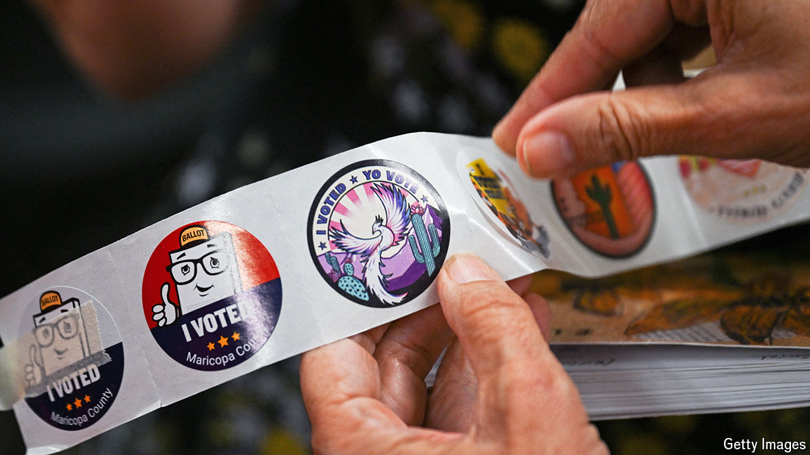

###### Valley fever

# A culture of conspiracy haunts Arizona’s elections 

##### America’s biggest swing county ramps up security before the vote 

 

> Oct 19th 2024 

“YOU’RE ON live streaming right now,” says Jennifer Liewer, a deputy elections director for Maricopa County, Arizona. “You can wave to your friends.” She takes your correspondent round the vote-tabulation centre, known as MCTEC, in downtown Phoenix. She points to cameras attached to the ceiling. They record everything that happens here. The county began broadcasting every hour of every day after the 2020 elections, when Maricopa’s results were audited several times over.

