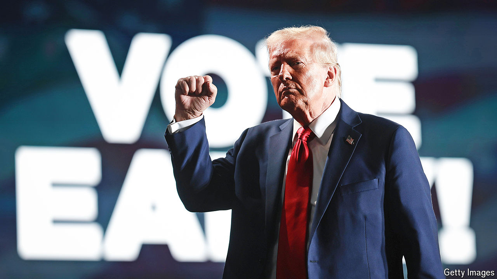

###### Early returns

# How to read America’s early-voting numbers 

##### Turnout is off to a roaring start but Republicans have made gains with initial ballot returns 

 

> Oct 24th 2024 

FOR THE first time since August, Donald Trump has overtaken Kamala Harris in ’s  of America’s presidential election. Our latest forecast gives Mr Trump a 53% chance of returning to the White House, up seven percentage points in the past week (see chart). Although the race remains more or less a coin toss, it is now weighted slightly in Mr Trump’s direction. The shift in our model reflects a steady narrowing of Ms Harris’s lead in national polls during the past month. State-specific polls published in the past week confirm that Mr Trump’s position has strengthened slightly in the plausibly decisive states. 

