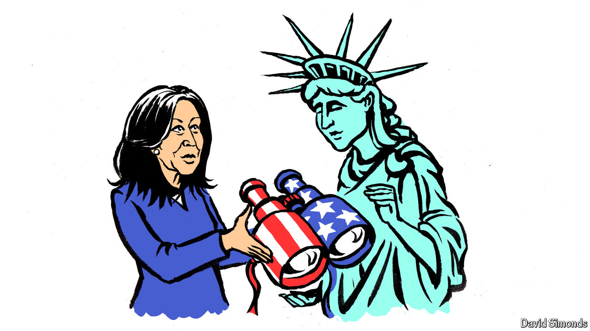

###### Lexington

# Kamala Harris’s closing argument 

##### Her vision of the future is also a nostalgic one. Do enough Americans still believe in it? 

 

> Oct 24th 2024 

Senator Barack Obama was well ahead of the country in 2007, or so believed some of Hillary Clinton’s campaign advisers. “Obama is unelectable except perhaps against Attila the Hun,” Mark Penn, her top strategist, wrote in an internal campaign memo in March that year. Mr Obama was trying to celebrate his background as “diverse” and “multicultural”, but Americans were not ready for that message. “Save it for 2050,” Mr Penn wrote.

