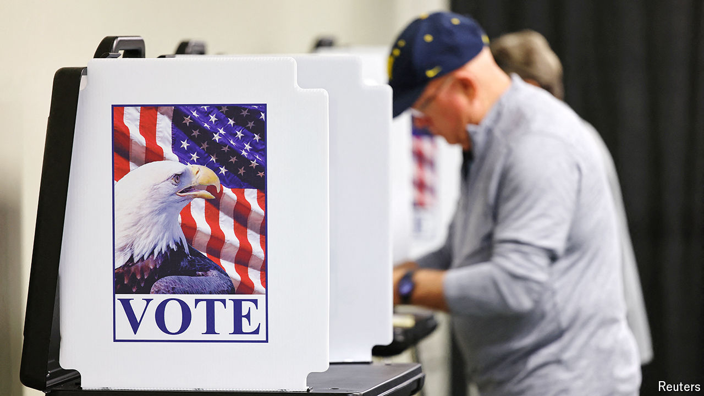

###### Flooding the polls

# Will Hurricane Helene tip the vote in North Carolina? 

##### Election officials in storm-ravaged counties must cope with damaged voting sites and Donald Trump’s calumnies 

 

> Oct 24th 2024 

Around a map spread out on a table, Buncombe County election organisers survey the terrain like generals plotting an assault. “The bridge is out here, but there’s another road,” points out Corrine Duncan, the director of elections. They are trying to relocate polling places damaged by Hurricane Helene last month. A red arrow shows where an emergency tent in a café car park will house polling booths. 

