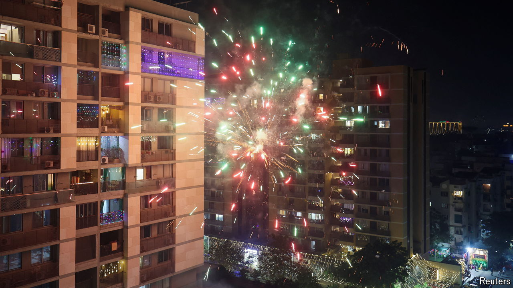

###### Prayer and profit


# India’s startups pray for a Hindu super-app 


##### The business of God could yet create an Indian unicorn 

 


> Oct 31st 2024 


The traditional start to Diwali, the Hindu festival of lights that falls on October 31st this year, is a  (ceremony of worship) either at home or at a temple. Technology has ushered in a third way: through the phone. The Sri Mandir app offers the devotee sitting anywhere in India or outside it a virtual  at an auspicious temple for 891 rupees ($11). On VAMA, another such service, 101 rupees allows them to light a lamp remotely in the holy city of Ayodhya. In addition to receiving divine goodwill, customers get a video to enable repeated viewing and, of course, sharing.

