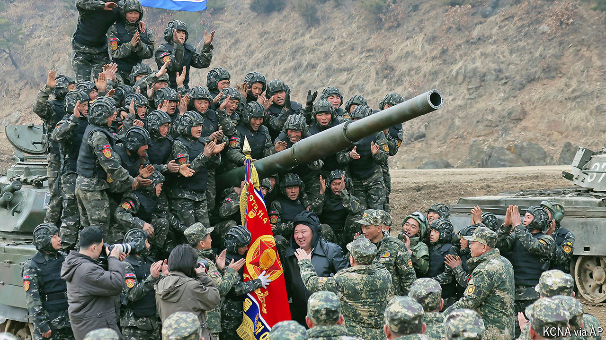

###### Neighbourhood strife

# North Korea’s fanatical regime just got scarier 

##### A new missile test, troops to Russia and death sentences for K-pop 

 

> Oct 30th 2024 

THE KAESONG Industrial Complex in North Korea has long symbolised hopes for peace and unity on the Korean peninsula. Opened in 2004, it housed South Korean factories that employed North Korean workers. Joint production trudged along until 2016, when South Korea turned off the lights in response to advances in North Korea’s nuclear programme; subsequent attempts to restart the project faltered. This month Kim Jong Un, North Korea’s dictator, made clear that it has no future by blowing up the roads that connect Kaesong to the south. 

